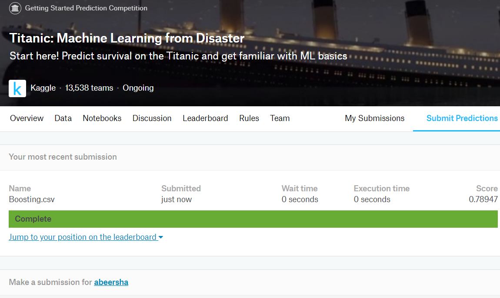

 # Project 2: part 2 'Titanic'
 ## Problem Statment:
 In this competition, we have a data set of different information about passengers onboard the Titanic,
 and we see if we can use that information to predict whether those people survived or not.
 ## Executive Summary:
 We started this competition by focusing on getting a well understanding of the dataset.
 The EDA is detailed and many visualizations are included. Then we provide Seven kind of modeling in order to reach to best predections.
 Gradient Boosting Classifier performs best with a score of 0.78.
 
 ## Datasets Description:
 
 
|Feature | Dataset |Data type | Description |
|---|---|---|---|
|PassengerId  | train/test|integer| An unique index for passenger rows|
|Survived |train|integer| Shows if the passenger survived or not|
|Pclass |train/test|integer|Ticket class|
|Name |train/test|object|Passenger's name|
|Sex |train/test|object|Passenger's sex. It's either Male or Female. |
|Age |train/test|float|Passenger's age|
|SibSp |train/test| integer|Number of siblings or spouses travelling with each passenger.|
|Parch  |train/test|integer|Number of parents of children travelling with each passenger.|
|Ticket  |train/test| object|Ticket number |
|Fare  |train/test|float|How much money the passenger has paid for the travel journey.|
|Cabin  |train/test|object|Cabin number of the passenger.|
|Embarked |train/test| object|Port from where the particular passenger was embarked/boarded.|

# Kaggle :

We provide 7 kind of modeling in order to reach to best predections.

Boosting Classifier performs best with a cross validation score of 0.789.
 

# Conclusion :

In this competition, we have a data set of different information about passengers onboard the Titanic,
and we see if we can use that information to predict whether those people survived or not.
We started this competition by focusing on getting a well understanding of the dataset. 
The EDA is detailed and many visualizations are included. Then we provide Seven kind of modeling Logistic Regression,
DecisionTreeClassifier, SVC, Random Forest Classifier, ExtraTreesClassifier, Gradient Boosting Classifier, Ada Boost Classifier :
in order to reach to best predections. Gradient Boosting Classifier performs best with a score of 0.78.
